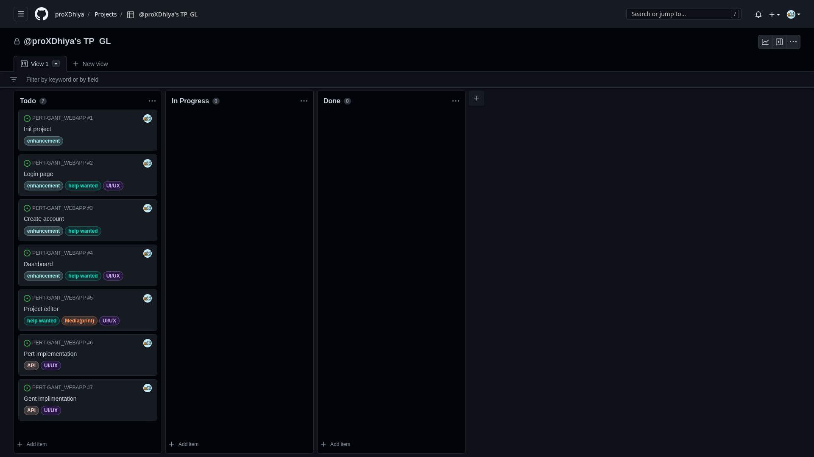
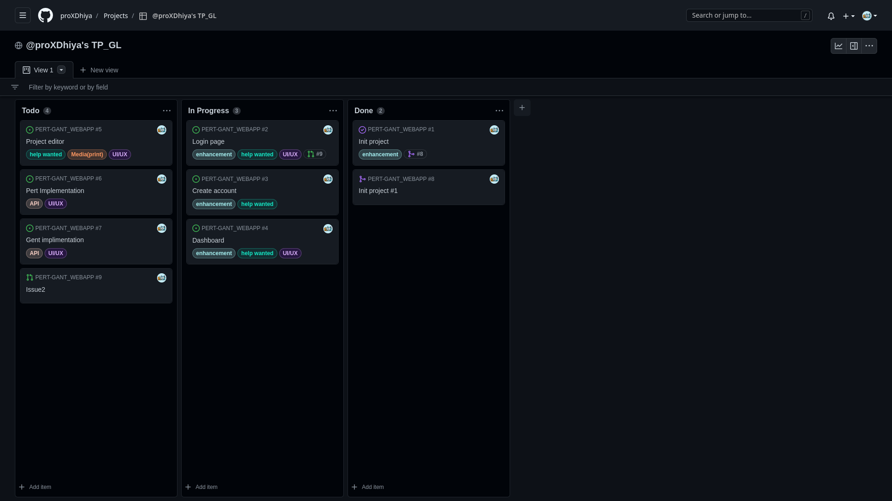
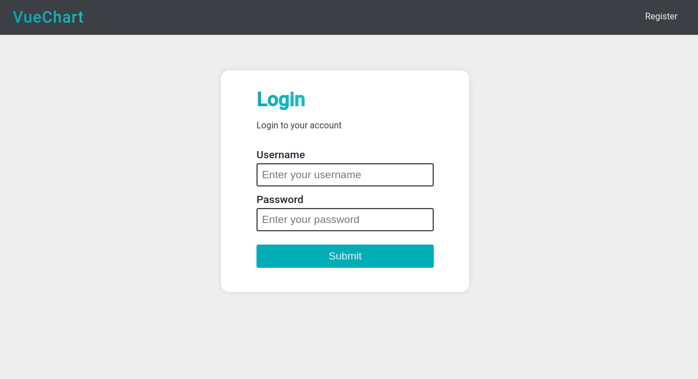
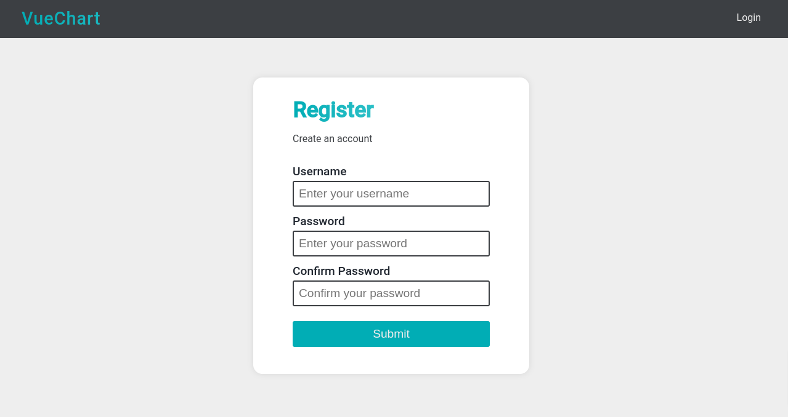
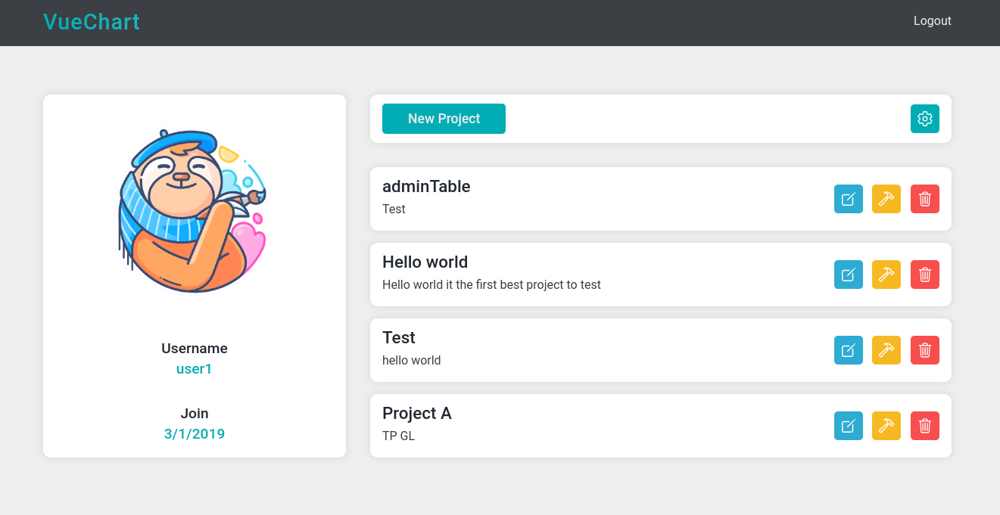
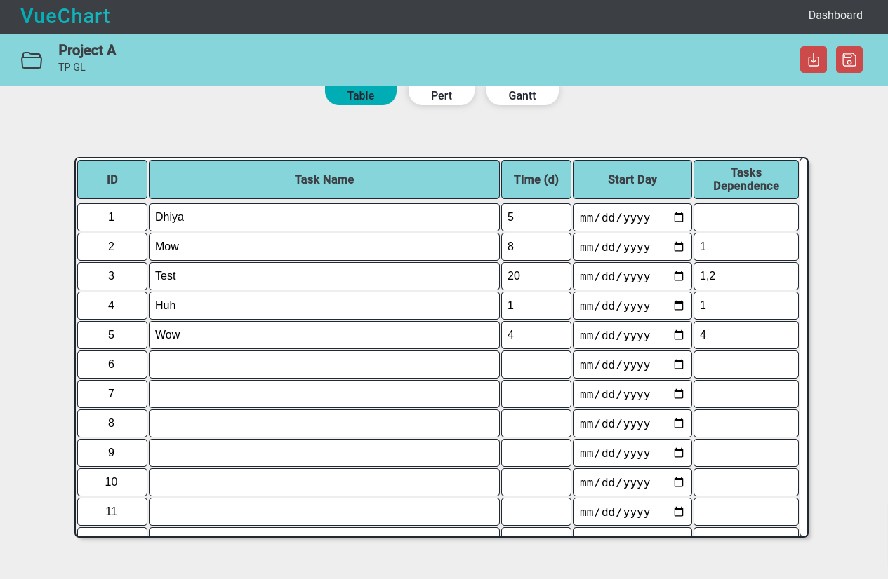
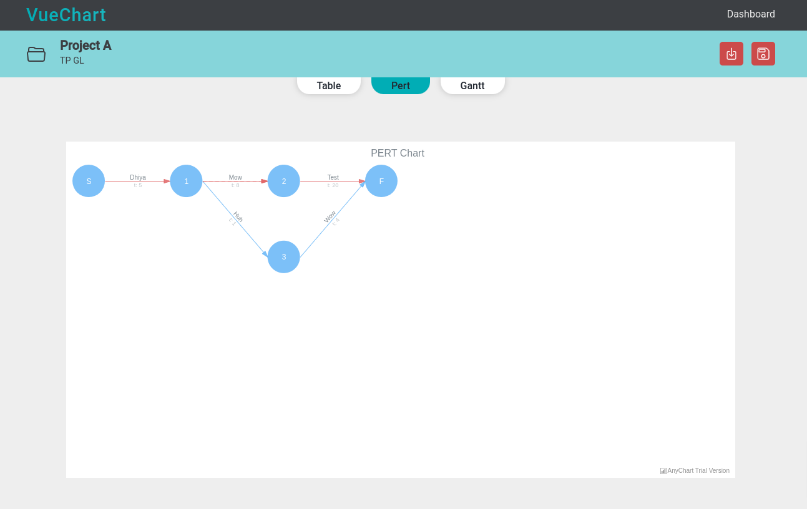

# GL TP (Web App PERT) 2022-2023

## List of Students
- Kellouche Dhiya
- Drahmoun Anis
- Senouci Aboubakre

---

## 1. Introduction

### What is Web App?
A web application is a software application that is accessed over a network, such as the Internet or an intranet. Web applications are often client–server applications, where the client (or user interface) runs in a web browser. Common web applications include webmail, online retail sales, online auctions, wikis, instant messaging services and many other functions.

<div style="margin-top: 30px"></div>

### What is PERT?
Project Evaluation and Review Technique (PERT) is a project management tool used to analyze and represent the tasks involved in completing a given project. It is a way to visualize the tasks involved in completing a project, identify task dependencies, estimate task durations, and calculate the overall project duration.

In this project, we will create a web application that will help us to manage our projects. We will be able to create a user account, create a project, add tasks to the project, and assign a task to a user. We will also be able to see the progress of the project and the tasks.

---

## 2. Project Architecture
- Frontend: Pug, Css, Javascript
- Backend: NodeJS, ExpressJS, Express-Session
- Database: JSON File

<div class="page"></div>

## 3. What is scrum?
Scrum is a framework within which people can address complex adaptive problems, while productively and creatively delivering products of the highest possible value. Scrum is a framework for developing, delivering, and sustaining complex products. Scrum is a framework for developing, delivering, and sustaining complex products. Scrum is a framework for developing, delivering, and sustaining complex products.

### How does SCRAM work?
Scrum is a framework for developing, delivering, and sustaining complex products. Scrum is a framework for developing, delivering, and sustaining complex products. Scrum is a framework for developing, delivering, and sustaining complex products.

### What is a sprint?
A sprint is a set period of time during which a scrum team works to complete a set amount of work. A sprint is a set period of time during which a scrum team works to complete a set amount of work. A sprint is a set period of time during which a scrum team works to complete a set amount of work.

### Example of a tasks:

<p style="text-align: center"> 1. Github Project Dashboard </p>

<div class="page"></div>

## 4. Github Project

### What is Github Project?
GitHub Projects is a project management tool built directly into GitHub. It helps you organize and prioritize your work, and keep track of your progress over time. GitHub Projects is a project management tool built directly into GitHub. It helps you organize and prioritize your work, and keep track of your progress over time. GitHub Projects is a project management tool built directly into GitHub. It helps you organize and prioritize your work, and keep track of your progress over time.

### Example of a github project dashboard using scrum:

<p style="text-align: center"> 2. Tasks in a Github Project Dashboard </p>

<div class="page"></div>

## 5. Project Structure
```bash
.
├── README.md
├── app.js
├── package-lock.json
├── package.json
├── pdf
│   └── RECAP.md
├── public
│   ├── css
│   │   └── style.css
│   ├── images
│   │   ├── 1.png
|   |── js
│   └── └── script.js
├── routes
│   ├── index.js
│   ├── login.js
│   ├── logout.js
│   ├── projects.js
│   ├── register.js
│   └── dashboard.js
├── views
│   ├── dashboard.pug
│   ├── index.pug
│   ├── login.pug
│   ├── projects.pug
│   └── register.pug
├── models
│   ├── project.js
│   └── user.js
├── controllers
│   ├── project.js
│   └── user.js
└── data
    ├── projects.json
    └── users.json
```

<div class="page"></div>

## 6. Screenshots


<p style="text-align: center"> 3. Login Page </p>


<p style="text-align: center"> 4. Register Page </p>


<p style="text-align: center"> 5. Dashboard Page </p>


<p style="text-align: center"> 6. Project Table </p>


<p style="text-align: center"> 7. PERT Page </p>
